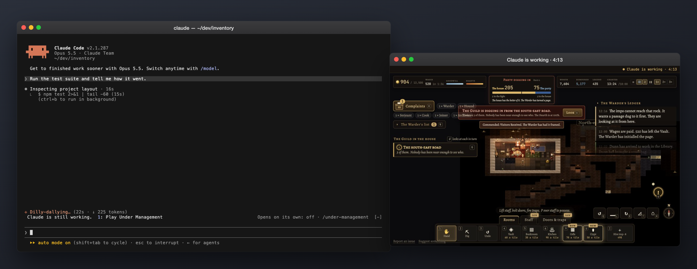
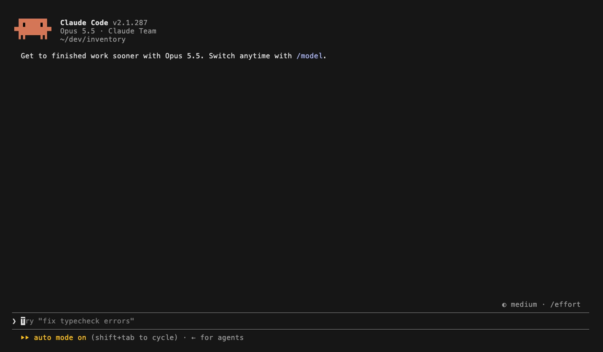
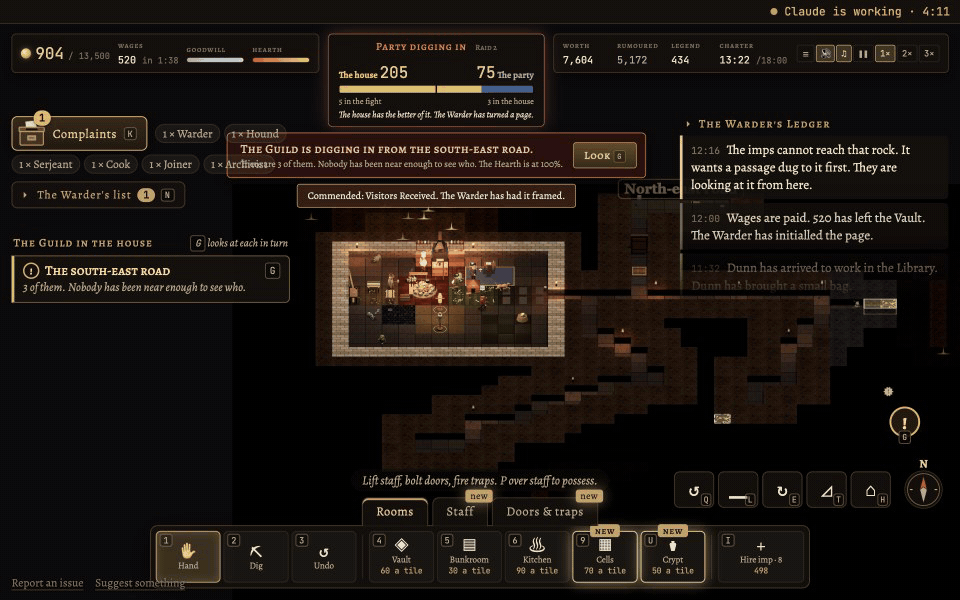
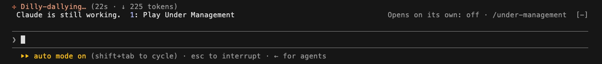

# Under Management, while Claude works

A Claude Code mod. Claude starts a long turn. Twenty seconds in, a strip appears above the prompt:
**Claude is still working. 1: Play Under Management.** Press 1 and the game opens in a window of its
own beside your terminal. When Claude finishes, the game pauses itself and tells you.



## Install

In Claude Code:

```
/plugin marketplace add Interesting-Systems/under-management-claude
/plugin install under-management@interesting-systems
```

That's it. The next time Claude works for more than 20 seconds, the strip appears. Press 1.

You need Claude Code 2.1.287 or later in a local session, in the terminal or the desktop app. A
cloud session can't open a window on your machine. Chrome or Edge gives you the app window; without
them the game opens in your default browser. An organization's policy can block installed mods.

## How it works

A real session, recorded in a real terminal. The project is a toy with a 25-second test suite.



Pressing 1 really did open the game window. The recorder only sees the terminal, so here is the
other side: the game, with Claude's clock in the strip at the top, and what happens when Claude
finishes.



> The Warder has marked the place in the ledger. He has also written down the time.

The game also pauses whenever its window loses focus, so the house isn't raided while you read
Claude's answer. Saves live in the window's own browser profile and keep between sessions.

## The game

Under Management is a 3D isometric dungeon-management game. You run the house: dig it out, build
rooms, hire staff who live and work there. Adventurers from the Guild arrive to take the gold, and
your job is to see that they don't. There are no unit orders. Your architecture is your tactics.
Real time, pausable.

The companion edition has four houses: Marrow's Rest, Ashfell, Penhallow and Undercliff. The rest
of the game's houses are behind a "More houses" button; see below. You can try the companion
edition without the mod at
[under-management.vercel.app/companion](https://under-management.vercel.app/companion).

## Commands

| Command | What it does |
| --- | --- |
| `/under-management` | Open the game now, without waiting for the strip |
| `/under-management auto on\|off` | Open the game on its own after the delay, no strip (off by default) |
| `/under-management delay <s>` | Seconds of work before the offer: 20 by default, 5 to 600 |
| `/under-management strip on\|off` | Show or hide the strip |
| `/under-management help` | List these, and show the current settings |

Settings are saved and apply to every session.



## Turning it off

Any of these:

- `/under-management strip off` keeps the mod but hides the offer. `/under-management` still works.
- `/plugin disable under-management@interesting-systems` turns the mod off.
- Uninstalling it from `/plugin` removes it.

## What it sends

The mod can't run a server, and a web page can't read the mod's files, so the two talk through a
relay on the game's site. Here is the whole of it:

- **Nothing at all** until you open the game window in a session. Install it, never press 1, and
  the mod never makes a request.
- After the window is open, once per turn: `working` with the time the turn started, then `ready`
  with how long it took. That goes to `https://under-management.vercel.app/api/companion` under a
  random 16-character code made for the session. The code is the only key to that record.
- Never the prompt, never the answer, never a file name or anything else about your work. The
  server keeps no IP addresses.

The game page itself behaves like the public web build: by default it sends an anonymous record
of play, meaning the game's own commands, which is how the houses get balanced. Press Esc in the
game and turn off "Send an anonymous record of play" to stop that.

The source for the whole exchange is in [`hooks/register.ts`](plugins/under-management/hooks/register.ts),
which is short.

## More houses

The companion stops at Undercliff. If about fifty people ask, the remaining houses go in. Asking is
a thumbs-up on the pinned issue,
[More houses?](https://github.com/Interesting-Systems/under-management-claude/issues/1), or the
"More houses" button in the game, which counts once per browser.

> The Warder has opened a file for requests. It is currently thin.

## Status

Tested live on macOS. The Windows launcher (Edge, falling back to the default browser) and the Linux
launcher (the first Chromium-family browser on the PATH, else `xdg-open`) are written and
unit-tested, but have not yet been tried on those machines. If you try one, an issue either way
would help.

31 tests run under `claude plugin test`, against both the terminal and desktop surfaces. CI
validates the manifests strictly and runs the tests on every push.

## Developing

```
claude --plugin-dir ./plugins/under-management     # run Claude Code with this checkout loaded
claude plugin test plugins/under-management        # the tests
claude plugin validate --strict .                  # the manifests
```

`UNDER_MANAGEMENT_URL` points the mod at another copy of the game, for example
`http://localhost:5174/companion`. The game's source isn't in this repo; the mod only knows the URL.

The layout: [`plugins/under-management/hooks/register.ts`](plugins/under-management/hooks/register.ts)
is the mod (the hooks, the strip, the window, the relay) and
[`hooks/lib.ts`](plugins/under-management/hooks/lib.ts) is the plain part (the session code, the
launchers for each platform, the command's arguments). Tests are in
[`plugins/under-management/tests`](plugins/under-management/tests).

## About

Under Management is made by one person and Claude Code: the code, the graphics, the sound, and
this mod.

MIT license. Under Management is a game from [Interesting Systems](https://github.com/Interesting-Systems).
